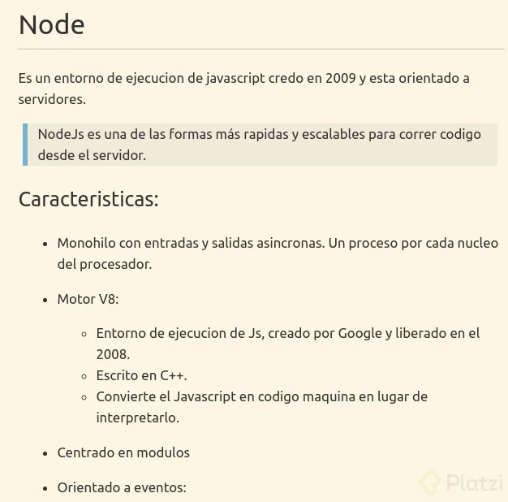
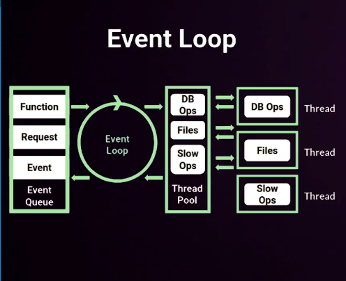
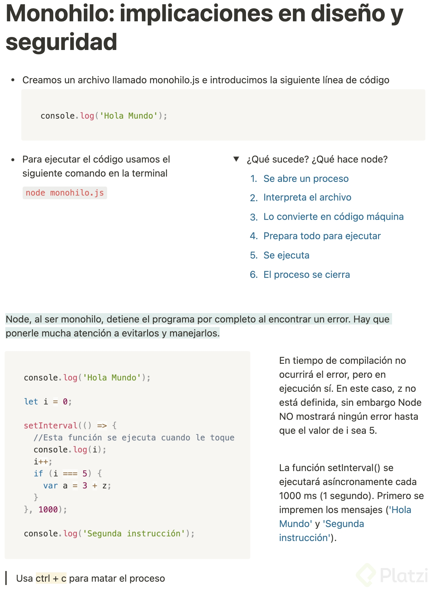
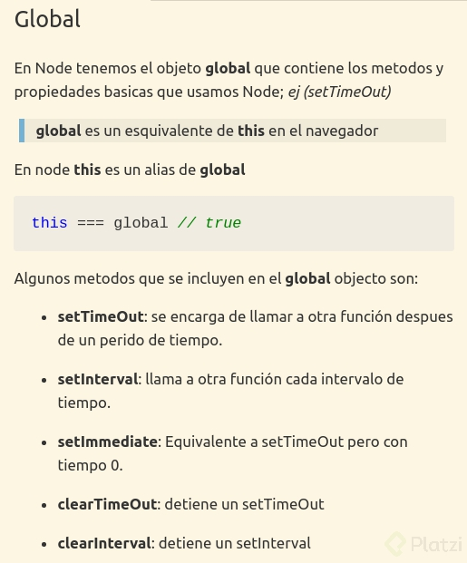

# Curso de Fundamentos de Node.js

---

# Indice

- [Descripcion](#descripcion)
  - [Estructura del programa](#estructura-del-programa)
    - [Async](#async)
    - [Conceptos](#conceptos)
    - [Herramientas](#herramientas)
    - [Memoria](#memoria)
    - [Modulos](#modulos)
    - [Paquetes](#paquetes)
    - [Trucos](#trucos)
    - [Globales](#globales)
- [Instalación de Node.js](#instalación-de-nodejs)
- [Comandos](#comandos)
- [Prueba](#prueba)

---
# Descripcion

La logica de cada uno de los programas y su funcionamiento se la encuentra descrito acontinuacion.

Dentro de la carpeta source se encuentra diversas carpetas las cuales cada una contiene una serie de programas para explicar el funcionamiento basico de framework de node js,en cada uno de los topicos.

### Teoria



#### Event loop: 
Es un proceso con un ++bucle ++que gestiona, de forma asíncrona, todos los eventos de tu aplicación.



#### Mono hilo



#### Callbacks

Una funcion callback es una funcion que es pasada como argumento a otra funcion, para ser llamada(called back) en otro momento.
La funcion que recibe como argumento otras funciones es denominada funcion de orden superior (higher-order function), esta contiene la logica correspondiente para ejecutar adecuadamente la funcion callback.

Los **callback Hell** se dan cuando se empieza a pasar una función como parámetro que a su vez llama a otra función como parámetro, y así hasta n.
Una estrategia para trabajar con estas estructuras lógicas tan monolíticas es usar estructuras de control y funciones recursivas.

Las funciones recursivas se llaman así mismas y mediante la estructura de control le digo cuantas veces voy a necesitar llamar la función así misma.

#### File system

El file system provee una API para interactuar con el sistema de archivos cerca del estándar POSIX.
POSIX es el estándar para interfaces de comando y shell, las siglas las significan: “Interfaz de sistema operativo portátil” la X de POSIX es por UNIX.

El file system nos permite acceder archivo del sistema, leer, modificar., escribirlos, es muy útil para precompiladores, para lo que requiera hacer grabados de disco, o bases de datos en node requieren un uso intensivo de Node.Todo lo que hagamos con modulos por buenas prácticas son asincronos, pero tienen una version sincrona no recomendada pues pordría bloquear el event loop con más facilidad.

#### Console

Con console podemos imprimir todo tipo de valores por
nuestra terminal.

- **console.log**: recibe cualquier tipo y lo muestra en el consola.
- **console.info**: es equivalente a log pero es usado para informar.
- **console.error**: es equivalente a log pero es usado para errores.
- **console.warn**: es equivalente a log pero es usado para warning.
- **console.table**: muestra una tabla a partir de un objeto.
- **console.count**: inicia un contador autoincremental.
- **console.countReset**: reinicia el contador a 0.
- **console.time**: inicia un cronometro en ms.
- **console.timeEnd**: Finaliza el cronometro.
- **console.group**: permite agrupar errores mediante identación.
- **console.groupEnd**: finaliza la agrupación.
- **console.clear**: Limpia la consola.

#### Errores (Try/Catch)
Cuando se genera un error, node propaga el error hacia arriba, hasta que esta es caputado. si el error no se captura node se detiene.

Siempre que sea posible debemos capturar todos los errores que se puedan generar en nuestros hilos.

#### Proceso Hijo

El módulo de procesos secundarios de **Node.js (child_process)** tiene dos funciones **spawn** y **exec**, mediante las cuales podemos iniciar un proceso secundario para ejecutar otros programas en el sistema.

La diferencia más significativa entre child_process.spawn y child_process.exec está en lo que spawn devuelve un stream y exec devuelve un buffer.

Usa spawn cuando quieras que el proceso hijo devuelva datos binarios enormes a Node.
Usa exec cuando quieras que el proceso hijo devuelva mensajes de estado simples.
Usa spawn cuando quieras recibir datos desde que el proceso arranca.
Usa exec cuando solo quieras recibir datos al final de la ejecución.

#### Process

El objecto process es una instancia de EventEmitter; podemos suscribirnos a el para escuchar eventos de node.

**UncaughtException**: Permite capturar cualquier error que no fue caputurado previamente. Esto evita que Node cierre todos los hijos al encontrar un error no manejado.

#### Datos almacenados vs en memoria
Todo esto funciona por tiempos, cuando vas a escribir en memoria todo funciona súper rápido, sin embargo, cuando tienes que escribir en disco el proceso es más lento.

Especialmente los discos duros antiguos (O sea, los que no son SSD) son súper lentos. Aunque los SSD sea más rápidos, siguen siendo más lentos que la memoria.

#### Buffer
Un buffer es un espacio de memoria (en la memoria ram), en el que se almacenan datos de manera temporal.

Es la forma mas cruda en la que se pueden almacenar los datos. (Se guardan en bytes y no se especifica el tipo de dato)

En la consola, los datos se muestran en formato hexadecimal.

#### Error First Callbacks
Un patrón que se sigue siempre en cualquier lenguaje y programa de devs es Error First Callbacks, esto quiere decir que siempre que tengamos un callback el primer parámetro debería ser el error.

😭 Esto se usa por la convención de que todo puede fallar.

Otro patrón típico es tener el callback es tener en el callback como la última función que se pasa. Aunque depende del caso.

#### Que es gulp.js? 📖🖥💥

Es una herramienta de construcción en JavaScript construida sobre flujos de nodos . Estos flujos facilitan la conexión de operaciones de archivos a través de canalizaciones . Gulp lee el sistema de archivos y canaliza los datos disponibles de un complemento de un solo propósito a otro a través del .pipe()operador, haciendo una tarea a la vez. Los archivos originales no se ven afectados hasta que se procesan todos los complementos. Se puede configurar para modificar los archivos originales o para crear nuevos. Esto otorga la capacidad de realizar tareas complejas mediante la vinculación de sus numerosos complementos. Los usuarios también pueden escribir sus propios complementos para definir sus propias tareas.

### Estructura del programa 

---
#### Async

- asyncAwait.js : Utiliza la palabra reservada await para esperar la respuesta de una funcion asincrona, con esto nos permite crear un dialogo y que las funciones asincronar funcionen secuencialmente
- callback.js : Muestra un ejemplo de como enviar una funcion como parametro para ejecutarla dentro de otra funcion dependiendo de las condiciones necesarias.
- callbackHell.js : Contiene un ejemplo para realizar un llamado de un funcion dentro del llamado de otra funcion, practicamente son callbacks anidados dentro de varia funciones.
- promises.js : Muestra un ejemplo para crear una promesa y manejar las respuestas a recibir como los errores que se pueden generar.

#### Conceptos

- entorno.js : Muestra ejemplo para manejar las variables de entorno que se reciben como parametros al ejecutar el programa.
- monohilo.js : Demuestra el manejo de sistema de framework node js y muestra la asincronia que existe al manejar los hilos.

#### Herramientas

- automatization: Utiliza la libreria gulp.js el cual nos permite  realizar una construcción (build system) en JavaScript que se utiliza para automatizar tareas comunes en el desarrollo web, para el ejemplo la accion a ejecutar es la cracion de un servidor.
- electronApp: Es una herramienta que nos permite realizar una aplicacion de escritorio, mediante el etiquetado html.
- scrapping: Es la herramienta mas popular para realizar testing en paginas web mediante el manejo del navegador como bot.
  
#### Memoria

- buffer.js : Muestra el manejo de la memerio y el almacenamiento de byte dentro de la direccion de memoria
- streams.js : Demuestra como se realiza la lectura y escritura sobre un archivo con formato txt

#### Modulos

- nativos : Contiene un ejemplo de como realizar un libreria en c que se pueda utilizar en node.js
- consola.js : Muestra los diferentes manejo de la libreria console y su uso en cada caso.
- errores.js : Muestra un ejemplo del uso del try y catch para atrapar errores inesperados.
- fs.js Desmuestra como utilizar la libreria de file system de node.js
- http.js: Muestra la funcionalidad para crear un servidor y administrar rutas con la libreria http.
- os.js: Contiene los metodos que maneja la libreria os para utilizar el funciones relacionadas con el sistema operativo.
- procesoHijo.js : Ejecuta un comando dentro del promp y maneja sus resultados dentro del proceso.
- process.js : Utiliza las diferentes opciones de un proceso y los eventos que estos generan para manejar sus acciones.
  
#### Paquetes

- modulo : Muestra la creacion un modulo propio y la utilizacion en otros archivos para su uso como una libreria.
- npm : Contiene la utitlizacion del gestor de paquetes npm
- utiles : Contiene el manejo de tres librerias importante que son las siguientes
  - Imagenes (sharp)
  - Encriptacion (bcrypt)
  - Tiempo (moment)

#### Trucos

- benchmaking.js : Utiliza la funcion time de la libreria console para contar el tiempo que se demora en ejecutar un bloque de codigo definido por el usuario. 
- errorFirst : Manejo del error en las funciones en caso de que suceda un error capturado en el sistema.

#### Globales



--- 
## Instalación de Node.js

Si vas a trabajar con Node.js, lo primero que tienes que hacer, es instalarlo en tu máquina. Ya sea con Windows, Linux o Mac, si vas a la web de Node.js (https://nodejs.org), la web detectará tu sistema operativo, y te ofrecerá un paquete con el que instalarlo.

Simplemente pulsa en el botón verde de la versión que quieras (mi recomendación es siempre usar las versiones LTS) y completar el proceso de instalación. Dependiendo del sistema operativo, te hará más o menos preguntas, pero con las opciones por defecto se instalará bien.

Como consejo, asegúrate de tener una buena conexión a internet cuando lo instales, para que tarde poco tiempo.

Una vez lo hayas instalado, para comprobar que todo funciona correctamente, abre una terminal (en windows, CMD o PowerShell valen perfectamente) y escribe:

```
node -v
```

Ese comando te devolverá la versión de Node.js que se ha instalado.

También nos habrá instalado NPM, el gestor de paquetes. Para asegurarte de que está instalado, puedes ejecutar:

```
npm -v
```

Y te devolverá la versión de NPM que hay instalada.

Con esto, ya tenemos instalado Node.js y NPM, que es todo lo que necesitamos para empezar con nuestro curso de Fundamentos de Node.js.

---
## Comandos

#### Paquete para visualizcion de cambios en tiempo real
	npm install -g nodemon

#### Instalar libreria para instalar encriptacion
	npm i bcrypt

#### Instalar libreria para manejo de fechas
	npm i moment

#### Instalar libreria para trabajr con imagenes 
	npm i sharp

#### Instalar libreria para hacer web scrapping
        npm i puppeteer

#### Instalar libreria para realizar aplicaciones de escritorio
	npm i electron

#### Instalar depedencia para trabajar con procesos y trabajar con un pequeno servidor
	npm i gulp gulp-server-livereload

#### Correr la tarea (gulp)
	npm run tarea --> nombre de la tarea creada

#### Correr un script con modulos en el archivo principal es6
	node --experimental-modules archivo.js

#### Correr un script para debugarle
	node --inspect archivo.js

---

## Prueba

> **1. ¿Cuál es el motor de JavaScript sobre el que corre Node?**
>      - V8

> **2. Cuando un evento llega al Event Loop, ¿dónde lo manda Node?** 
> 	   - A thread pool

> **3. ¿Cómo accedemos a una variable de entorno llamada NOMBRE?**
> 	   - process.env.NOMBRE

> **4. ¿Qué pasa si salta un error no capturado en el hilo principal?**
> 	   - El proceso se detiene

> **5. ¿Cual es la herramienta más adecuada para ejecutar nuestros procesos de Node en producción?**
> 	   - PM2

> **6. ¿Cómo se le llama a la función que se ejecuta cuando termina otra función asíncrona?**
> 	   - Callback

> **7. ¿Cuál es la mejor forma de evitar un Callback Hell?**
>	   - Todas son correctas

> **8. ¿Cuántos parámetros puede recibir el then de una promesa?**
> ```Javascript
>promise
>.then()
>.catch()
>- 

> **9. ¿Se puede usar la palabra reservada "await" en cualquier sitio?**
> 		- No, solo en funciones declaradas con async

> **10. ¿Cuál de los siguientes módulos NO está en los módulos globales?**
> 		- crypto

> **11. ¿Cómo indentamos un nivel los logs de consola?**
> 		- console.group

> **12. Por defecto, ¿cómo detectamos que un fichero se ha escrito con fs.writeFile?**
> 		- Con el callback

> **13. Cuando se lanzan excepciones, ¿cómo las capturamos?**\
> 		- Con try / catch

> **14. ¿Se pueden ejecutar comandos del sistema desde NodeJS? ¿Cómo?** 
> 		- Si, con procesos hijo

> **15. ¿En qué lenguajes se pueden desarrollar módulos nativos para NodeJS?**
> 		- JavaScript y C++

> **16. ¿En qué puerto se puede iniciar un servidor HTTP en Node?**
> 		- En cualquiera

> **17. ¿Podemos acceder a la memoria disponible y total del sistema operativo desde NodeJS?** 
> 		- Si, con el módulo OS

> **18. ¿Podemos controlar cuando se cierra el proceso de Node, y ejecutar código antes de que muera?** 
> 		- Si, con el módulo Process

> **19. ¿Dónde se listan las dependencias de nuestro proyecto?**
> 		- En el package.json

> **20. Cuando creamos un módulo, ¿podemos exportar mas de una entidad?**
> 		- Si, tantas como queramos

> **21. ¿Qué módulo nos permite trabajar con imágenes desde NodeJS?**
> 		- Sharp

> **22. ¿Cuál es la principal ventaja de trabajar en memoria frente a la lectura y escritura en disco?**
> 		- La velocidad es mayor

> **23. ¿Qué es un Buffer?**
> 		- Un conjunto de datos crudos

> **24. ¿Puede un stream transformar datos?**
>		- Si, usando un stream de transformación

> **25. ¿Cómo sabemos lo que tarda un trozo de código en ejecutarse?**
>		- Usando console.time

> **26. ¿Podemos parar el código en un punto determinado mientras se ejecuta?**
>		- Si, con el debugger

> **27. En un callback, ¿cuál debería ser el primer parámetro?**
>		- El error

> **28. ¿Podemos usar NodeJS para acceder al DOM de un sitio externo y extraer información de él?**
>		- Si, con puppeteer

> **29. ¿Qué herramienta nos permite crear tareas en NodeJS para automatizar procesos?**
>		- Gulp

> **30. ¿Se puede usar NodeJS para crear aplicaciones de escritorio?**
>		- Si, con Electron