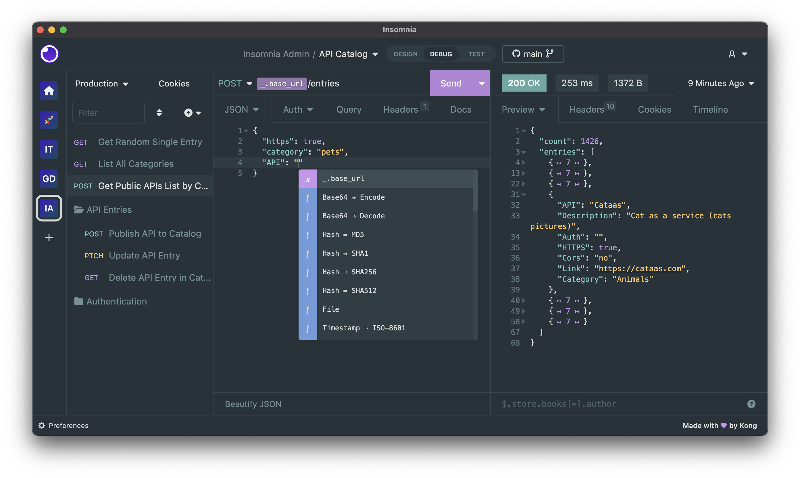

# Instalación de Postman o Insomia

Para poder probar nuestra API de forma más productiva vamos a tener que usar algún cliente de APIs que nos permita hacer las pruebas de funcionamiento de lo que estás construyendo, los dos clientes más famosos son **Insomnia** y **Postman** y vas a necesitar de alguno de ellos para ir probando cada característica que vamos a ir construyendo en nuestro servicio de Platzi Store.

## Insomnia


Como cliente para probar APIs tiene grandes características, destaca principalmente por una interfaz limpia y sencilla, pero a la vez potente, en donde puede configurar ambientes, exportar e importar, gran soporte con GraphQL, etc. Insomnia será el que vamos a usar en este curso 🙂



### Instalación

La instalación es sencilla, solo tienes que ingresar a https://insomnia.rest/download y descargar el instalador. Una vez esté descargado lo ejecutas y sigues los pasos de la instalación; en caso de Windows descarga un archivo .exe, en caso de Mac descarga un .dmg, y finalmente, en caso de Ubuntu descargas el .deb.

## Postman

Es uno de los más usados y legendariamente nos ha acompañado por mucho tiempo, además cuenta con características similares a Insomnia como: exportar e importar, ambientes, entornos, y provee una API para hacer testing muy potente.

### Instalación Windows y Mac

La instalación es sencilla solo tienes que ingresar a https://www.postman.com/downloads/
y descargar el instalador, una vez esté descargado lo ejecutas y sigues los pasos de la instalación, en caso de Windows descarga un archivo .exe y en caso de Mac descargas un archivo comprimido lo descomprimes y ahí sigues el proceso.

### Instalación Linux

```
# Debian, Ubuntu y derivados
sudo apt install postman
# Arh, Manjaro
sudo pacman -S postman
# Fedora
sudo yam install postman
```