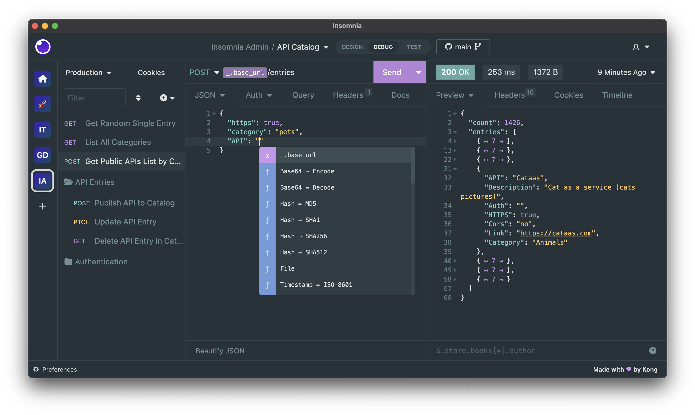

# Curso de Backend con Node.js: API REST con Express.js

---
## Indice

- [Descripcion](#descripcion)
  - [Product](#product)
  - [User](#user)
  - [Home](#home)
  - [Categories](#categories)
- [Comandos](#comandos)
- [Middlewares populares en Express.js](#middlewares-populares-en-expressjs)
- [Instalación de Postman o Insomia](#instalación-de-postman-o-insomia)
  - [Insomnia](#insomnia)
  - [Postman](#postman)
-

---

## Descripcion

El proyecto de este curso es desarrollar una Api Rest, la cual expondra productos falsos, en las consultas.

Este proyecto esta formado por consultas que contiene el sistema de CRUD (Creacion, Lectura, Actualizar ,Borrar)

Los endpoints utilizados comienzan todos por la siguiente ruta

- **/api/v1**

Ademas el proyecto contiene el maneo de middlewares lo cual nos permiten realizar las validaciones corrrespondientes y manejo de errores.

Los endpoint que se encuentra creados son los siguientes.

#### Product
- **/api/v1/products/filter** (GET)
    Retorna un mensaje para para visualizar la accion del endpoint

- **/api/v1/products** (GET)
    Retorna la lista de todos los elementos creados de forma randomica

- **/api/v1/products/{id}** (GET)
    Retorna el elemento que le corresponda al id enviado

- **/api/v1/products** (POST)
    Crea un nuevo producto y lo agrega a la lista y retorna un mensaje de confirmacion

- **/api/v1/products/{id}** (PATCH)
    Actualiza un producto con el id enviado como parametro y retorna un mensjae de confirmacion

- **/api/v1/products/{id}** (DELETE)
    Elimina un elemento mediante un id ingresado

#### User
- **/api/v1/users/** (GET)
    Retorna los datos enviados dentro la consulta como son el limite y el offset, internamente solo nos permite visualizar el manejo de parametros
#### Home
- **/api/v1/** (GET)
    Retorna un mensaje el cual es solo para confirmar que esta en ruta inicial

- **/api/v1/nueva-ruta** (GET)
    Retorna un mensaje el cual nos muestra que la ruta ingresada es otra
#### Categories
- **/api/v1/categories/{categorieId}/products/{productId}** (GET)
  Retorna los id de categoria y productos dentro de una respuesta con JSON

---

## Comandos

#### Instalar dependencia necesarias para realizar la configuracion del proyecto

- npm i nodemon eslint eslint-config-prettier eslint-plugin-prettier pritter -D

#### Instalar express
- npm i express

#### Instalar dependncia para manejar datos falsos, version mas estable
- npm i faker@5.5.3

#### Instlar libreria boom para el manajeo de errores
- npm i @hapi/boom

#### Instalar la libreria joi para validacion de datos
- npm i joi

#### Libreria para manejar las consultas de otro origienes cors
- npm i cors

--- 

## Middlewares populares en Express.js

A continuación te compartiré una lista de los middlewares más populares en Express.

#### CORS

Middleware para habilitar CORS (Cross-origin resource sharing) en nuestras rutas o aplicación. http://expressjs.com/en/resources/middleware/cors.html

#### Morgan

Un logger de solicitudes HTTP para Node.js. http://expressjs.com/en/resources/middleware/morgan.html

#### Helmet

Helmet nos ayuda a proteger nuestras aplicaciones Express configurando varios encabezados HTTP. ¡No es a prueba de balas de plata, pero puede ayudar! https://github.com/helmetjs/helmet

#### Express Debug

Nos permite hacer debugging de nuestras aplicaciones en Express mediante el uso de un toolbar en la pagina cuando las estamos desarrollando. https://github.com/devoidfury/express-debug

#### Express Slash

Este middleware nos permite evitar preocuparnos por escribir las rutas con o sin slash al final de ellas. https://github.com/ericf/express-slash

#### Passport

Passport es un middleware que nos permite establecer diferentes estrategias de autenticación a nuestras aplicaciones. https://github.com/jaredhanson/passport

Puedes encontrar más middlewares populares en el siguiente enlace: http://expressjs.com/en/resources/middleware.html

---

## Instalación de Postman o Insomia

Para poder probar nuestra API de forma más productiva vamos a tener que usar algún cliente de APIs que nos permita hacer las pruebas de funcionamiento de lo que estás construyendo, los dos clientes más famosos son **Insomnia** y **Postman** y vas a necesitar de alguno de ellos para ir probando cada característica que vamos a ir construyendo en nuestro servicio de Platzi Store.

### Insomnia


Como cliente para probar APIs tiene grandes características, destaca principalmente por una interfaz limpia y sencilla, pero a la vez potente, en donde puede configurar ambientes, exportar e importar, gran soporte con GraphQL, etc. Insomnia será el que vamos a usar en este curso 🙂



#### Instalación

La instalación es sencilla, solo tienes que ingresar a https://insomnia.rest/download y descargar el instalador. Una vez esté descargado lo ejecutas y sigues los pasos de la instalación; en caso de Windows descarga un archivo .exe, en caso de Mac descarga un .dmg, y finalmente, en caso de Ubuntu descargas el .deb.

### Postman

Es uno de los más usados y legendariamente nos ha acompañado por mucho tiempo, además cuenta con características similares a Insomnia como: exportar e importar, ambientes, entornos, y provee una API para hacer testing muy potente.

#### Instalación Windows y Mac

La instalación es sencilla solo tienes que ingresar a https://www.postman.com/downloads/
y descargar el instalador, una vez esté descargado lo ejecutas y sigues los pasos de la instalación, en caso de Windows descarga un archivo .exe y en caso de Mac descargas un archivo comprimido lo descomprimes y ahí sigues el proceso.

#### Instalación Linux

```
# Debian, Ubuntu y derivados
sudo apt install postman
# Arh, Manjaro
sudo pacman -S postman
# Fedora
sudo yam install postman
```
---

## Prueba

> **1. ¿Cuál es propósito de instalar nodemon?**
>      - Nos funciona para hacer livereload cada que hagamos cambios en archivos js

> **2. Nos funciona para hacer livereload cada que hagamos cambios en archivos js**
>     - app.listen(8000)

> **3. ¿Cuál método de express nos sirve para retornar un formato json como respuesta?**
>     - app.json({...})

> **4. ¿Cuál es la manera correcta de declarar una ruta que reciba un parámetro llamado productId?**
>     - app.get('/products/:productId',  ...)

> **5. ¿Cuál es la manera correcta para obtener el parámetro productId enviado desde una ruta con GET?**
>     - const { productId } = req.params;

> **6. ¿Cuál es la manera correcta de obtener parámetros tipo query de una ruta con GET?**
>     - const { limit, offset } = req.query;

> **7. ¿Cuál es la definición más adecuada para el principio de Single Resposability?**
>     - Cada módulo, clase o función debería tener una sola responsabilidad.

> **8. Cada módulo, clase o función debería tener una sola responsabilidad.**
>     - app.use(express.json())

> **9. ¿Cuál es la forma correcta para definir una ruta de tipo patch para actualizar una entidad?**
>     - router.patch('/tasks/:id', ...)

> **10. ¿Cuál es la forma correcta de enviar un error de tipo 404 con una respuesta tipo JSON?**
>     - res.status(404).json({ message })

> **11. ¿Cuál es la responsabilidad principal de los servicios?**
>     - Usualmente está toda la lógica de negocio y resuelve los casos de uso

> **12. ¿Qué parámetros debemos recibir para tener un middleware que lea errores?**
>     - error, req, res y next

> **13. ¿Cuál es el objetivo de la librería Boom?**
>     - Manejo de errores http

> **14. ¿Cuál es el objetivo de la librería Joi?**
>     - Validación de datos por medio de un schema

> **15. ¿Si una solicitud sale desde el mismo origen, hay problema de CORS?**
>     - Falso

> **16. ¿Cuál es el objetivo del archivo Procfile de Heroku?**
>     - Es este archivo ejecutamos un script para correr la app en prod.
