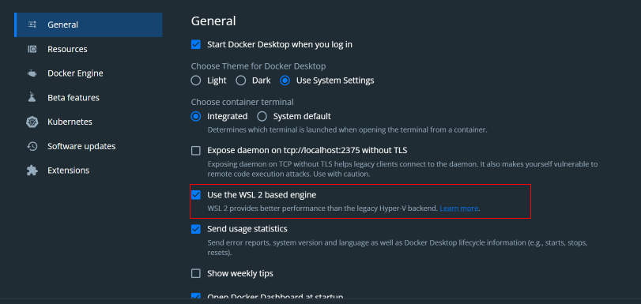
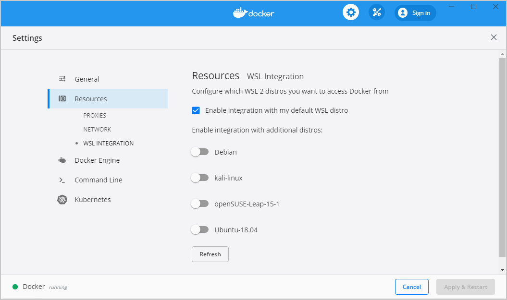
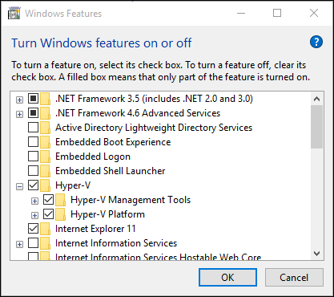
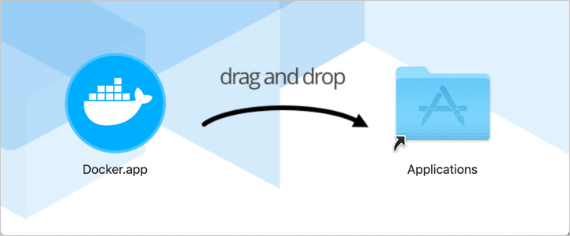

# Curso de Backend con Node.js: Base de Datos con PostgreSQL

---
## Indice

---

## Descripcion

En este programa se implementara todo lo relacionado a los siguientes temas
  - Migraciones
  - Creacion de esquemas
  - Consultas a base de datos.
  - Relaciones entre tablas.

La bases de datos las cuales soporta el progrma son Posgrest y MySql, todo el programa se encuentra realizado con contenedores docker.

El programa consiste en una tienda virtual, la cual posee varios endPoint los cuales nos permitira realizar la creacion de productos, ordenes de compras, categorias,  y clientes.

Con esto se administrara las partes basicas para la aplicacion de la tienda virtual.

Los endpoints que se encuentran creados se encuentran en el archivo Insomnia.json, los cuales se abren exclusivamente en la aplicacion Insomnia.

---

## Comandos 

#### Instalar las dependencias de un proyecto realizado

- npm i

#### Libreria para manejar postgres con node.js

- npm install pg

#### Libreria para manejar las variables de entorno

- npm install dotenv

#### Instalara libreria ORM manejo de la base de datos
- npm install --save sequelize

#### Dependendica para trabajar la libreria orm y postgres
- npm install --save pg pg-hstore

#### Dependencia para trabajar con la libreria orm y mysql
- npm install --save mysql2

#### Instalas dependeica para trabajar con migraciones con el orm sequlize en modo desarrollo
- npm i sequelize-cli --save-dev

### Manejo de docker

#### Ejecutar un contenedor de docker

- docker-composer up -d <name_service> 

#### Verificar que procesos de docker esta corriendo

- docker-composer ps

#### Bajar un proceso corriendo en el docker

- docker-composer down

#### Ingresar a un bash dentro del contenedor via terminal

- docker-compose exec postgres bash

#### Visualizar lso proceso en docker con el id

- docker ps

#### Inpeccionar el contenedor mediante el id

- docker inspect <id>


### Manejo de postgres

#### Revisar la base de datos en postgres

- psql -h localhost -d <Base de datos> -U <usuario>

#### Revisar si existe alguna tabla en postgres

- \d+

#### Salir de la base de datos

- \q
--- 


## Instalación de Docker

Según el sistema operativo que utilices puede variar la instalación, así que a continuación te daré las indicaciones base para la instalación según tu sistema operativo:

### Instalación en Windows con WSL (Recomendada) 🐧

Debes descargar el instalador desde la página de Docker for Windows.

Cuando ya tienes instalado Docker Desktop dentro de tus programas debes abrirlo y debes asegurarte que la opción **“Use the WSL 2 based engine”** está habilitada:



Luego en la sección “Resources > WSL Integration”, asegurarate que la opcion “Enable integration with my default WSL distro”, este habilitada:



Puedes ver más detalles de Docker con WLS 👉[Docker Desktop WSL 2 backend](https://docs.docker.com/desktop/wsl/)

### Instalación en Windows 🪟

Debes descargar el instalador desde la página de [Docker for Windows](https://docs.docker.com/desktop/install/windows-install/).

Cuando ya tienes instalado **Docker Desktop** dentro de tus programas, una de las cosas que debes tener en cuenta en la instalación con Windows es que debes contar con **Windows 10 de 64 Bits** o superior y debes habilitar el [Hyper-V](https://docs.docker.com/desktop/install/windows-install/#system-requirements) de Windows.

Si quieres conocer los detalles, aquí te dejo el detalle como [habilitar Hyper-V desde la Interfaz de Windows](https://learn.microsoft.com/en-us/virtualization/hyper-v-on-windows/quick-start/enable-hyper-v)



### Instalación en macOS 🍎

En Mac tienes dos opciones. Todo dependerá si tienes los nuevos chips M1 o Intel, ya que hay un instalable apropiado para ambas arquitecturas de chip. Puedes escoger el instalable desde [Install Docker Desktop on Mac](https://docs.docker.com/desktop/install/mac-install/).

Adicionalmente, si cuentas con los nuevos chips M1, debes ejecutar la siguiente instrucción en tu terminal softwareupdate --install-rosetta

Una vez descargues el instalador adecuado, solo debes seguir los pasos y pasar Docker Desktop a tus aplicaciones.



### Instalación en Ubuntu 🐧

Estos son los pasos para instalarlo dentro de Ubuntu, sin embargo, también puedes ver directamente [Install Docker Engine on Ubuntu](https://docs.docker.com/engine/install/ubuntu/)

```
sudo apt-get update
```

```
sudo apt-get install \
    ca-certificates \
    curl \
    gnupg \
    lsb-release
```

```
sudo mkdir -p /etc/apt/keyrings
```

```
curl -fsSL https://download.docker.com/linux/ubuntu/gpg | sudo gpg --dearmor -o /etc/apt/keyrings/docker.gpg
```

```
echo \
  "deb [arch=$(dpkg --print-architecture) signed-by=/etc/apt/keyrings/docker.gpg] https://download.docker.com/linux/ubuntu \
  $(lsb_release -cs) stable" | sudo tee /etc/apt/sources.list.d/docker.list > /dev/null
```

```
sudo apt-get update
```

```
sudo apt-get install docker-ce docker-ce-cli containerd.io docker-compose-plugin
```

```
sudo docker run hello-world
```

Para otras distribuciones de Linux:
- [Install Docker Engine on CentOS](https://docs.docker.com/engine/install/centos/)
- [Install Docker Engine on Debian](https://docs.docker.com/engine/install/debian/)
- [Install Docker Engine on Fedora](https://docs.docker.com/engine/install/fedora/)

---

## Instalación de Postman o Insomia

Para poder probar nuestra API de forma más productiva vamos a tener que usar algún cliente de APIs que nos permita hacer las pruebas de funcionamiento de lo que estás construyendo, los dos clientes más famosos son **Insomnia** y **Postman** y vas a necesitar de alguno de ellos para ir probando cada característica que vamos a ir construyendo en nuestro servicio de Platzi Store.

### Insomnia


Como cliente para probar APIs tiene grandes características, destaca principalmente por una interfaz limpia y sencilla, pero a la vez potente, en donde puede configurar ambientes, exportar e importar, gran soporte con GraphQL, etc. Insomnia será el que vamos a usar en este curso 🙂


#### Instalación

La instalación es sencilla, solo tienes que ingresar a https://insomnia.rest/download y descargar el instalador. Una vez esté descargado lo ejecutas y sigues los pasos de la instalación; en caso de Windows descarga un archivo .exe, en caso de Mac descarga un .dmg, y finalmente, en caso de Ubuntu descargas el .deb.

### Postman

Es uno de los más usados y legendariamente nos ha acompañado por mucho tiempo, además cuenta con características similares a Insomnia como: exportar e importar, ambientes, entornos, y provee una API para hacer testing muy potente.

#### Instalación Windows y Mac

La instalación es sencilla solo tienes que ingresar a https://www.postman.com/downloads/
y descargar el instalador, una vez esté descargado lo ejecutas y sigues los pasos de la instalación, en caso de Windows descarga un archivo .exe y en caso de Mac descargas un archivo comprimido lo descomprimes y ahí sigues el proceso.

#### Instalación Linux

```
# Debian, Ubuntu y derivados
sudo apt install postman
# Arh, Manjaro
sudo pacman -S postman
# Fedora
sudo yam install postman
```
---


## Prueba

> **1. ¿Cuál es comando que usamos para levantar el contendedor de Postgres con Docker?**
>      - docker-compose up -d postgres

> **2. ¿Es una buena práctica manejar nuestra conexión con Postgres usando la estrategia de pooling?**
>     - Verdadero

> **3. ¿Cuál es la forma correcta de leer la variable de ambiente PORT con NodeJS?**
>     - proccess.env.PORT

> **4. ¿SequelizeORM se puede conectar a MySql y Postgres o solo funciona para Postgres?**
>     - Funciona para ambos

> **5. ¿Cuál es la forma de definir un campo como Integer con Sequelize?**
>     - DataTypes.INTEGER

> **6. ¿Cuál es la forma de obtener una entidad de la base de datos con base a la PK?**
>     - models.MyModel.findByPk(myId)

> **7. ¿Cuál es la forma de eliminar una entidad de la base de datos con base a la PK?**
>     - const model = await models.MyModel.findByPk(myId) await model.destroy();.

> **8. ¿Cuál es el puerto por defecto en el cual Mysql corre por defecto?**
>     - 3306

> **9. ¿Correr la forma de sync de Sequelize es recomendado para producción?**
>     - Falso

> **10. ¿Cuál es la funcionalidad de sequelize-cli ?**
>     - Scripts para correr y manejar migraciones

> **11. ¿Cuál es el método que nos ofrece queryInterface para agregar una columna?**
>     - queryInterface.addColumn(...)

> **12. ¿Cuál es la forma de crear una entidad en la base de datos usando Sequelize?**
>     - models.MyModel.create(...)

> **13. ¿Cuáles son los métodos que nos ofrece sequelize para expresar una relación uno a uno?**
>     - hasOne  y belongsTo

> **14. ¿Cuáles son los métodos que nos ofrece sequelize para expresar una relación uno a muchos?**
>     - hasMany y belongsTo

> **15. ¿Cuáles son los métodos que nos ofrece sequelize para expresar una relación muchos a muchos?**
>     - belongsToMany

> **16. ¿Cuál es la forma en que podemos hacer paginación usando Sequelize?**
>     - models.MyModel.findAll({ limit, offset })

> **17. ¿Cuál es el atributo que nos da Sequelize para obtener relaciones desde el método findAll?**
>     - include
